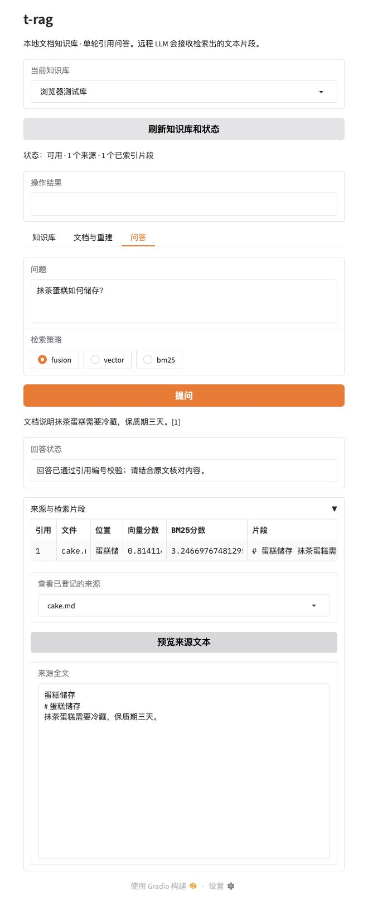

# 通用 RAG 首期验证记录

日期：2026-10-04。范围：[收缩规格](../spec/2026-10-04-general-rag-spec.md)。功能已实施，未提交或推送。

## 自动检查

| 检查 | 结果 |
|---|---|
| 单元及契约测试 | 40 passed，默认跳过1项真实服务测试，3.16秒 |
| 真实服务集成测试 | 1 passed，3.62秒；独立临时目录、t_rag_集合，测试结束清理 |
| 安装 | pip隔离构建并安装 t-rag 0.1.0 成功，安装过程中无需新增运行依赖 |
| CLI | 模块入口及 .venv/bin/t-rag --help正常；创建/列表/必选--kb契约通过 |
| 源码 | 所有源码模块可导入 |
| 脚本 | bash -n scripts/start.sh scripts/dev.sh通过 |
| 空白检查 | git diff --check通过 |

命令：

```bash
PYTEST_DISABLE_PLUGIN_AUTOLOAD=1 .venv/bin/python -m pytest -q
T_RAG_INTEGRATION=1 PYTEST_DISABLE_PLUGIN_AUTOLOAD=1 .venv/bin/python -m pytest tests/integration -q
```

本地集成使用实际 Qdrant 和 BAAI/bge-base-zh-v1.5 Embedding 服务，未替换为假向量。既有 fin_rag_docs 和 data/docstore未修改。

## 固定场景与结果

| 场景 | 结果 |
|---|---|
| 两库同名same.md、同含蛋糕冷藏关键词 | vector/bm25/fusion均只返回所选库，ALPHA/BETA内容不混用 |
| 重复重建 | 片段数量保持一致，无重复累积 |
| 文档修改ALPHA→GAMMA | 查询先要求重建；重建后两路及融合不返回旧标记 |
| 移除数据源 | 先拒绝旧索引；重建后全部策略为空；原文件仍在 |
| 配置改变Embedding模型 | 查询要求重建，不混用旧索引 |
| 写库失败/重建期间文件变化 | 状态为失败，不发布为可用；失败重试恢复 |
| 重启时building状态 | 改为失败并要求重建 |
| 删除失败 | 记录失败，支持再次删除；原目录文件保持 |
| 第二进程 | 文件锁拒绝同一数据目录的并发进程 |
| PDF12页 | 第11页内容及页码完整读取 |
| XLSX/CSV44行 | 最后行参与解析并有行范围 |
| 无引用/越界引用/空答案/无候选 | 拒答；无候选不调用模型 |
| 来源预览 | 仅当前库已登记文档ID；其他库/任意路径拒绝 |

以上主要验证可重复的正确性，不是文档规模、并发或事实质量的完整基准。未给出未经测量的统一延迟承诺。

## 浏览器验证

使用 Codex本机浏览器访问临时 Gradio 17860端口，数据目录为 /tmp/t_rag-browser-data，不使用正式业务资料。实际完成：

1. 创建“浏览器测试库”，页面显示未建索引。
2. 添加本地测试目录，显示需要重建。
3. 全量重建，显示1个文档/1个片段及可用状态。
4. 提问“抹茶蛋糕如何储存？”，展示带[1]引用的回答、cake.md、蛋糕储存章节及原文片段。
5. 预览登记来源全文正常；向量原始分数约0.814，BM25约3.247。
6. 移除数据源，页面要求重建并拒绝旧索引问答；重建后0片段。
7. 通过文件选择器上传同一测试Markdown，点击导入、重建后恢复带引用问答。
8. 最终代码重启页面复核，已有知识库与索引状态初始化一致，问答及全文预览通过；保存最终截图。

知识库删除及原文件保护通过真实集成和故障注入测试，未在浏览器执行永久删除。上传的复制与替换另有单元测试。



## 验证限制与依赖告警

- 浏览器LLM为本机固定响应的测试服务，仅证明问答链路和引用展示，**未验证真实远程LLM的答案质量或付费调用**。真实Qdrant/Embedding已验证。
- 文件上传功能完成，但Gradio5.50.0上传进度的SSE模拟对象在关闭时记录“Method not implemented.”及一次“Response”控制台信息；定位于安装依赖的index-DputZZxm.js，业务回调成功。未修改vendor或升级框架掩盖该问题。
- 真实集成有Pydantic UnsupportedFieldAttributeWarning，来自LlamaIndex模型适配依赖，未导致失败。页面Dataframe参数弃用问题已按当前安装签名修正。
- 支持本机单进程；重建期间暂停问答；OCR、多轮会话、流式生成、版本发布和独立任务系统未实现。

临时页面和测试模型在验证后关闭；预先运行的Qdrant/Embedding保留。
